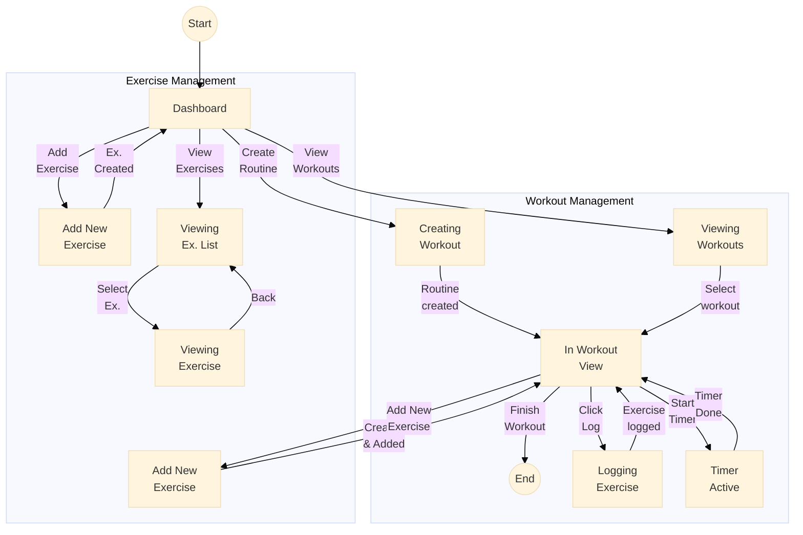

# Design Document: Obsidian Gym Log

This document outlines the design of the Obsidian Gym Log system and proposes a change to improve the user experience.

## 1. System Overview

The Obsidian Gym Log is an advanced workout tracking system built within Obsidian. It leverages several community plugins to provide a rich and interactive experience for logging and tracking workouts.

### 1.1. Core Components

*   **Obsidian:** The core platform, providing the file-based knowledge management system.
*   **Plugins:**
    *   **Dataview:** Used for querying and displaying workout data, such as workout lists and exercise history.
    *   **Meta Bind:** Provides UI elements like buttons to trigger actions within notes.
    *   **Templater:** Used for creating new notes from templates, with dynamic content like dates and times.
    *   **QuickAdd:** The core of the workflow automation, used for creating new exercises, workouts, and logging sets.
    *   **CustomJS:** Allows for custom JavaScript code to be used within the vault, providing advanced functionality for rendering charts and custom views.
    *   **Obsidian Charts:** Used for rendering charts.
    *   **Heatmap Calendar:** Used for visualizing workout frequency.
*   **Templates:** A collection of templates in the `Templates` directory for creating new exercises and workouts.
*   **Custom Scripts:** Custom JavaScript code in the `_js` directory that is used by `dataviewjs` blocks.

### 1.2. Data Model

*   **Exercises:** Each exercise is a note in the vault, with metadata such as name, muscle group, and equipment.
*   **Workouts:** Each workout is a note, created from a template. It contains a list of exercise IDs in its frontmatter, and the body of the note is used to log sets for each exercise.
*   **Workout Routines:** These are pre-defined workout templates, like `push-1.md`, which contain a list of exercises.

## 2. Workflows

### 2.1. Creating a New Exercise

1.  The user clicks the "Add New Exercise" button on the "Gym Log Dashboard".
2.  This triggers a QuickAdd choice, which likely presents a form to the user to enter the exercise details.
3.  A new note is created for the exercise, based on the `Templates/exercises/Exercises.base` template.

### 2.2. Creating a New Workout Routine

1.  The user clicks the "Create Workout Routine" button on the "Gym Log Dashboard".
2.  This triggers a QuickAdd choice, which copies a template (e.g., `push-1.md`) to a new note.
3.  The user is expected to manually edit the `exercises` and `workout_order` fields in the frontmatter of the new note to include the desired exercises. This is the main pain point the user wants to address.

### 2.3. Logging a Workout

1.  The user starts a workout by clicking the "Start Today's Workout" button.
2.  This creates a new note from a workout routine template.
3.  The user logs exercises by clicking the "Log Exercise" button, which triggers a QuickAdd choice to select an exercise and enter details like weight and reps.

## 3. Proposed Change: Seamless Exercise Creation

To improve the workout creation workflow, we propose adding a button to the workout routine template that allows the user to create a new exercise and have it automatically added to the current workout.

### 3.1. Implementation Details

The implementation will involve a combination of QuickAdd choices, custom scripts, and modifications to the workout template.

#### 3.1.1. New QuickAdd Choice and Script

1.  **Create a new QuickAdd choice:** This choice will be responsible for the entire workflow of creating a new exercise and adding it to the workout.
2.  **Create a new script `add-exercise-to-workout.js`:** This script will be called by the new QuickAdd choice. It will perform the following steps:
    a. **Get the current workout note:** The script will get the currently active file, which is the workout note being edited.
    b. **Call the existing `add-exercise-to-library.js` script:** It will call the existing script to handle the creation of the new exercise.
    c. **Get the new exercise ID:** The `add-exercise-to-library.js` script will be modified to return the ID of the newly created exercise.
    d. **Update the workout note's frontmatter:** The script will read the frontmatter of the workout note, add the new exercise ID to the `exercises` and `workout_order` arrays, and then write the updated frontmatter back to the note.

#### 3.1.2. Modify `add-exercise-to-library.js`

The existing `add-exercise-to-library.js` script needs to be modified to return the new exercise ID.

1.  A variable `exerciseId` will be created to store the randomly generated ID.
2.  This `exerciseId` will be added to the `params.variables` object, so it can be accessed by the calling script.

#### 3.1.3. Update Workout Template

1.  **Add a "Add New Exercise" button** to the workout routine templates (e.g., `Templates/Workouts/gym/push-1.md`).
2.  This button will be a `meta-bind-button` that triggers the **new** QuickAdd choice created in step 3.1.1.

### 3.2. User Experience

1.  When creating or editing a workout routine, the user can click the "Add New Exercise" button directly within the workout note.
2.  This will open the exercise creation dialog.
3.  After creating the exercise, the new exercise will be automatically added to the `exercises` and `workout_order` lists in the workout's frontmatter, and the user will see the change reflected in the note.

This approach provides a truly seamless experience for the user, as they no longer need to manually edit the frontmatter.

## 4. User Workflow State Diagram

The following state diagram illustrates the user's workflow when creating and logging a workout.

## 5. Code Structure Diagram

The following diagram illustrates the code structure of the Obsidian Gym Log, showing the relationships between user actions, scripts, shared modules, and data files.

```mermaid
%%{init: {'theme': 'base', 'themeVariables': { 'fontSize': '14px'}, "flowchart": {"useMaxWidth": true, "nodeSpacing": 30, "rankSpacing": 40}} }%%

graph TD

    subgraph User

        U_CreateWorkout["Create New <br>Workout <br>(from Template)"]

        U_CreateRoutine["Create New <br>Workout Routine"]

        U_LogExercise["Log an <br>Exercise"]

        U_ViewWorkout["View a <br>Workout"]

        U_ViewExercise["View an Exercise"]

    end



    subgraph Scripts ["/js/scripts/"]

        S_CreateWorkout["create-workout.js"]

        S_CreateRoutine["create-workout-routine.js"]

        S_LogExercise["log-exercise.js"]

    end



    subgraph Shared Modules ["/js/shared/"]

        M_Workout["workout.js"]

        M_Exercise["exercise.js"]

        M_ExerciseLib["exercise-library.js"]

        M_Timer["timer.js"]

        M_Utils["utils.js"]

    end



    subgraph Data

        D_WorkoutTemplates["Workout Templates (*.md)"]

        D_ExerciseTemplates["Exercise Templates (*.md)"]

        D_WorkoutInstances["Workout Instances (*.md)"]

        D_LoggedExercises["Logged Exercises (*.md)"]

        D_Categories["categories.json"]

        D_WorkoutCategories["workout_categories.json"]

    end



    subgraph Obsidian

        O_QuickAdd["QuickAdd API"]

        O_Templater["Templater Plugin"]

        O_Dataview["Dataview Plugin"]

        O_ObsidianAPI["Obsidian API (app)"]

    end



    %% User Actions to Scripts

    U_CreateWorkout --> S__CreateWorkout

    U_CreateRoutine --> S_CreateRoutine

    U_LogExercise --> S_LogExercise



    %% Scripts to Obsidian APIs

    S_CreateWorkout --> O_QuickAdd

    S_CreateWorkout --> O_Templater

    S_CreateWorkout --> O_ObsidianAPI

    S_CreateRoutine --> O_QuickAdd

    S_CreateRoutine --> O_ObsidianAPI



    %% Scripts to Data

    S_CreateWorkout --> D_WorkoutTemplates

    S_CreateWorkout --> D_WorkoutInstances

    S_CreateRoutine --> D_ExerciseTemplates

    S_CreateRoutine --> D_Categories

    S_CreateRoutine --> D_WorkoutCategories

    S_CreateRoutine --> D_WorkoutTemplates



    %% Dataview Renderings (User Views to Modules)

    U_ViewWorkout --invokes--> M_Workout

    U_ViewExercise --invokes--> M_Exercise



    %% Shared Modules to Obsidian APIs

    M_Workout --> O_Dataview

    M_Workout --> O_ObsidianAPI

    M_Exercise --> O_Dataview

    M_Exercise --> O_ObsidianAPI

    M_Timer --> O_Dataview



    %% Shared Modules to Data

    M_Workout --> D_LoggedExercises

    M_Workout --> D_ExerciseTemplates

    M_Exercise --> D_LoggedExercises



    %% Module Dependencies

    M_Workout --> M_Utils

    M_Workout --> M_ExerciseLib

    S_CreateRoutine --> M_ExerciseLib

```

